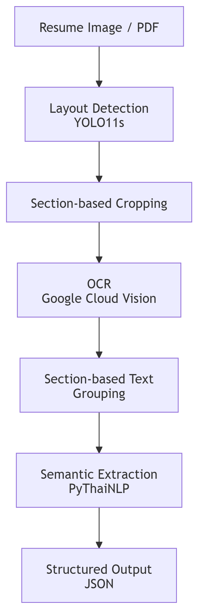
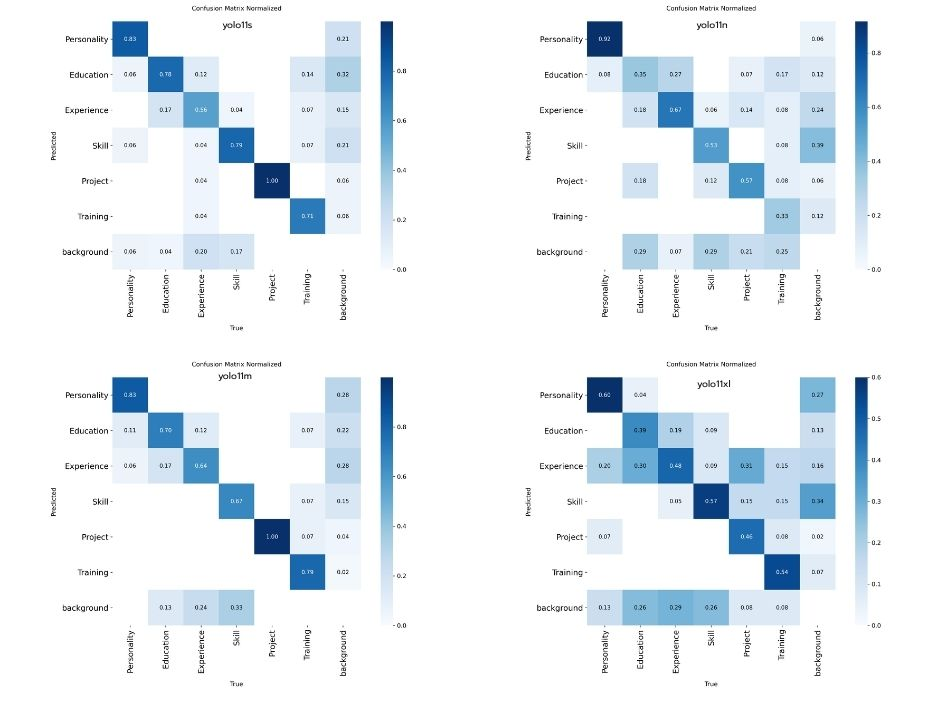

# 📄 A Layout-Aware Resume Parsing Pipeline Using YOLO, OCR, NLP

## 🔍 Project Overview

โครงการนี้มีเป้าหมายเพื่อพัฒนาระบบ **Resume Parsing แบบ Layout‑Aware** สำหรับแปลงเรซูเม่ในรูปแบบ **ภาพหรือไฟล์ PDF** ซึ่งเป็นเอกสารที่ไม่มีโครงสร้าง (unstructured documents) 
ให้กลายเป็น **ข้อมูลเชิงโครงสร้าง (Structured Data)** โดยอัตโนมัติ ระบบถูกออกแบบให้เข้าใจทั้ง **โครงสร้างการจัดวางของเอกสาร (Document Layout)** และ **ความหมายของข้อความ (Semantic Content)** 
ผ่านสถาปัตยกรรมแบบ **Multi‑Stage Hybrid Pipeline** ที่ผสานเทคนิคจาก **Computer Vision, OCR และ Natural Language Processing (NLP)** เข้าด้วยกัน

โครงการนี้ได้รับแรงบันดาลใจจากงานวิจัย  
**_A Hybrid OCR–XGBoost–Transformer Pipeline for Resume Parsing with Spatial‑Semantic Integration_**  
โดยมีการปรับสถาปัตยกรรมให้เหมาะสมกับการใช้ **Vision‑based Layout Detection** ด้วย YOLO

---

## ❗️ Problem Statement
เรซูเม่มักอยู่ในรูปแบบเอกสารที่ไม่มีโครงสร้าง เช่น PDF หรือรูปภาพ และมีรูปแบบการจัดวางที่แตกต่างกันไปอย่างมาก ทำให้การดึงข้อมูลสำคัญ เช่น Education, Experience และ Skills ไม่สามารถทำได้อย่างแม่นยำด้วยการประมวลผลข้อความเพียงอย่างเดียว ระบบ Resume Parsing แบบดั้งเดิมที่อาศัยกฎตายตัวหรือ template มักไม่สามารถรองรับเรซูเม่ที่มี layout หลากหลายได้อย่างมีประสิทธิภาพ โดยเฉพาะเรซูเม่ที่มีหลายคอลัมน์หรือรูปแบบเชิงสร้างสรรค์ ปัญหาหลักคือการขาดระบบที่สามารถ **เชื่อมโยงข้อมูลเชิงพื้นที่ของเอกสารเข้ากับการประมวลผลเชิงความหมายของข้อความ** เพื่อแปลงเรซูเม่ที่ไม่มีโครงสร้างให้เป็นข้อมูลเชิงโครงสร้างได้อย่างถูกต้อง

---

## 🎯 Objectives

- พัฒนาระบบ Resume Parsing แบบ **Layout‑Aware**
- ตรวจจับและแยก section หลักของเรซูเม่โดยอัตโนมัติ
- ดึงข้อความจากแต่ละ section อย่างแม่นยำ
- ประมวลผลข้อความเชิงความหมายแบบ **Section‑Aware**
- แปลงข้อมูลเรซูเม่ให้อยู่ในรูปแบบ **Structured JSON**

---

## 📚 Dataset Description
ชุดข้อมูลที่ใช้ในโครงการประกอบด้วย **เรซูเม่จำนวน 200 ใบ** ในรูปแบบไฟล์ภาพและ PDF  
ลักษณะของข้อมูล:
- 🗂 โครงสร้างเรซูเม่หลากหลาย (1–2 คอลัมน์)
- 🌐 รองรับทั้งภาษาไทยและภาษาอังกฤษ
- 🧪 ใช้สำหรับการฝึกและทดสอบระบบ Layout Detection และ Parsing

---

## 🛠️ Tools & Libraries
- ⚡ **YOLO11** – ตรวจจับโครงสร้างและส่วนประกอบของเรซูเม่  
- 🎥 **OpenCV** – จัดการและประมวลผลภาพ  
- 🔤 **OCR Engine (Google Cloud Vision)** – แปลงข้อความจากภาพ  
- 🧾 **pythainlp** – ประมวลผลภาษาธรรมชาติและดึงข้อมูลเชิงความหมาย  
- 🐍 **Python** – ภาษาหลักในการพัฒนาระบบ  

---
## 🔗 System Architecture

---
## 🌐 Methodology
### 1️⃣ Layout Detection (YOLO11s)
ตรวจจับ section หลักของเรซูเม่ เช่น Personality, Education, Experience, Skills, Project และ Training เพื่อระบุขอบเขตและตำแหน่งเชิงพื้นที่ของข้อมูล

### 2️⃣ Section‑based Image Cropping
ตัดภาพเรซูเม่ตาม bounding box เพื่อลดสัญญาณรบกวนและแยกการประมวลผลแต่ละ section อย่างอิสระ

### 3️⃣ Optical Character Recognition (OCR)
ใช้ Google Cloud Vision API แปลงข้อความจากภาพเป็นตัวอักษร โดยทำ OCR แยกตาม section เพื่อรักษาบริบทของข้อมูล

### 4️⃣ Semantic Information Extraction (NLP)
ใช้ PyThaiNLP สำหรับการประมวลผลข้อความภาษาไทย ช่วยตัดคำและจัดรูปแบบข้อความ รองรับการประมวลผลแบบ Section‑Aware Semantic Extraction

### 5️⃣ Structured Output
จัดเก็บผลลัพธ์สุดท้ายในรูปแบบ JSON พร้อมนำไปใช้งานหรือต่อยอดในระบบอื่น

---

## 🔀 Experimental / Sample Results

### 👀 1. การจับคู่ข้อมูลรูปภาพและป้ายกำกับ (Image–Label Pairing)
ขั้นตอนแรกของการทดลองคือการเตรียมและตรวจสอบความถูกต้องของข้อมูลที่ใช้ในการฝึกโมเดลตรวจจับโครงสร้างเอกสาร (Layout Detection) ซึ่งประกอบด้วยการจับคู่ระหว่างไฟล์รูปเรซูเม่และไฟล์ป้ายกำกับ (label) ที่ระบุขอบเขตและประเภทของแต่ละ section

### 📚 1.1 Input
ข้อมูลนำเข้า (Input) เป็นเรซูเม่ในรูปแบบไฟล์ภาพหรือ PDF ซึ่งถูกแปลงเป็นภาพก่อนนำเข้าสู่กระบวนการประมวลผล โดยเรซูเม่แต่ละใบมีรูปแบบการจัดวางที่แตกต่างกัน เช่น แบบหนึ่งคอลัมน์และสองคอลัมน์
- ตัวอย่าง Input: รูปเรซูเม่ต้นฉบับทั้ง 2 แบบ (1 column และ แบบ 2 column) โดยยังไม่มีการแบ่ง section หรือประมวลผลใด ๆ

### 🔢 1.2 Label
ป้ายกำกับ (Label) ถูกสร้างขึ้นเพื่อระบุขอบเขตของแต่ละ section ภายในเรซูเม่ โดย Label มีทั้งหมด 6 Label ได้แก่ Personality, Education, Experience, Skill, Project, Training โดยใช้รูปแบบ bounding box เพื่อกำหนดตำแหน่งเชิงพื้นที่ของข้อมูลในหน้าเอกสาร ขั้นตอนนี้เป็นส่วนสำคัญสำหรับการฝึกโมเดล YOLO ให้เรียนรู้โครงสร้างของเรซูเม่

### 🧮 1.3 Output (ผลลัพธ์จากขั้นตอนการ Labeling)

ผลลัพธ์ของขั้นตอนนี้คือชุดข้อมูลที่ผ่านการจับคู่ระหว่างรูปเรซูเม่และป้ายกำกับอย่างสมบูรณ์ (image–label pairs) ซึ่งถูกใช้เป็นข้อมูลฝึกและทดสอบโมเดล Layout Detection ในขั้นตอนถัดไป การตรวจสอบความถูกต้องของการ label ในขั้นนี้ช่วยให้มั่นใจว่าโมเดลได้รับข้อมูลที่ถูกต้องและสอดคล้องกับโครงสร้างจริงของเอกสาร

---

### 🧿 2. การตรวจจับโครงสร้างเรซูเม่ด้วย YOLO11 (YOLO11 Series)

เพื่อให้ได้โมเดลตรวจจับโครงสร้างเรซูเม่ที่เหมาะสมที่สุดสำหรับระบบนี้ งานวิจัยได้ทำการทดลองใช้โมเดล **YOLO11** หลายขนาด ได้แก่ **YOLO11n, YOLO11s, YOLO11m และ YOLO11xl** ซึ่งแต่ละขนาดมีความแตกต่างกันในด้านความซับซ้อนของโมเดล จำนวนพารามิเตอร์ และสมดุลระหว่างความแม่นยำกับความเร็วในการประมวลผล

#### 🤖 2.1 กระบวนการ (Process)

ในขั้นตอนนี้ เรซูเม่ในรูปแบบภาพที่ผ่านการเตรียมและมีป้ายกำกับ (label) จากขั้นตอน Image–Label Pairing จะถูกนำมาใช้เป็นข้อมูลนำเข้า (input) สำหรับการฝึกและทดสอบโมเดล YOLO11 แต่ละขนาด โดยแต่ละโมเดลถูกฝึกภายใต้เงื่อนไขเดียวกัน เพื่อให้สามารถเปรียบเทียบประสิทธิภาพได้อย่างเป็นธรรม
กระบวนการทำงานของโมเดล YOLO11 ประกอบด้วย:
- รับภาพเรซูเม่เป็น input
- ประมวลผลภาพผ่าน convolutional neural network
- ตรวจจับตำแหน่ง bounding box ของแต่ละ section
- จำแนกประเภทของ section เช่น Education, Experience และ Skills

โมเดลแต่ละขนาดถูกประเมินโดยใช้ชุดข้อมูล validation โดยพิจารณาค่าตัวชี้วัดมาตรฐาน ได้แก่ Precision, Recall และ mAP@0.5 เพื่อนำมาเปรียบเทียบและเลือกโมเดลที่เหมาะสมที่สุดสำหรับการใช้งานใน pipeline ของระบบ

#### 🖼️ 2.2 ผลลัพธ์และการเปรียบเทียบ (Results and Comparison)

จากการทดลองเปรียบเทียบโมเดล YOLO11 หลายขนาด พบว่าโมเดลแต่ละขนาดมีจุดเด่นที่แตกต่างกัน โดยโมเดลขนาดเล็ก (YOLO11n) มีความรวดเร็วในการประมวลผลแต่ให้ความแม่นยำต่ำกว่า ในขณะที่โมเดลขนาดใหญ่ (YOLO11m และ YOLO11xl) ให้ความแม่นยำสูงขึ้นแต่มีความซับซ้อนและใช้ทรัพยากรในการประมวลผลมากกว่า

จาก Confusion Matrix แสดงให้เห็นว่า **YOLO11s** ให้สมดุลที่เหมาะสมที่สุดระหว่างความแม่นยำในการตรวจจับโครงสร้างเรซูเม่และประสิทธิภาพในการประมวลผล โดยสามารถตรวจจับ section หลักของเรซูเม่ได้อย่างมีประสิทธิภาพ อยู่ในระดับที่เพียงพอสำหรับการใช้งานเป็นโมดูล Layout Detection ในระบบ Resume Parsing

ดังนั้นจึงเลือกใช้ **YOLO11s** เป็นโมเดลหลักสำหรับขั้นตอนการตรวจจับโครงสร้างเอกสาร เนื่องจากสามารถแยก section ได้อย่างชัดเจน และเหมาะสมกับการนำผลลัพธ์ไปใช้ในขั้นตอน OCR และการประมวลผลเชิงความหมายในลำดับถัดไป

#### 📈 2.3 ผลลัพธ์ของ YOLO11s และการประเมินผลโมเดล (Results and Evaluation)

การประเมินประสิทธิภาพของโมเดล YOLO11s ในขั้นตอนการตรวจจับโครงสร้างเรซูเม่ดำเนินการโดยใช้ชุดข้อมูลสำหรับการทดสอบ (validation set) เพื่อวัดความสามารถของโมเดลในการระบุขอบเขตและประเภทของแต่ละ section ภายในเอกสาร การประเมินผลใช้ตัวชี้วัดมาตรฐานสำหรับงานตรวจจับวัตถุ ได้แก่ **Precision**, **Recall** และ **mAP@0.5 (mAP50)**

#### ✅ ตัวชี้วัดที่ใช้ในการประเมิน

- **Precision** วัดความแม่นยำของการตรวจจับ โดยแสดงสัดส่วนของ bounding box ที่โมเดลตรวจจับได้อย่างถูกต้องเทียบกับจำนวนที่โมเดลทำนายทั้งหมด (Precision สูงหมายถึงโมเดลไม่ตรวจจับผิดพลาดบ่อย)
- **Recall** วัดความสามารถของโมเดลในการตรวจจับ section ที่มีอยู่จริงในเรซูเม่ (Recall สูงหมายถึงโมเดลพลาดน้อย)
- **mAP@0.5 (Mean Average Precision at IoU 0.5)** เป็นคะแนนรวมที่สะท้อนทั้งความแม่นยำของตำแหน่ง bounding box และการจำแนกประเภท โดยพิจารณาว่า bounding box ที่ตรวจจับได้มีค่าความซ้อนทับ (IoU) กับข้อมูลจริงอย่างน้อย 50%

#### 📊 ผลการประเมินรายคลาส (Per-Class Results)

| Class        | Precision | Recall | mAP50 |
|--------------|-----------|--------|-------|
| Personality  | 100.0%    | 62.9%  | 80.9% |
| Education    | 72.0%     | 56.5%  | 65.5% |
| Experience   | 94.7%     | 56.0%  | 72.3% |
| Skill        | 70.8%     | 40.5%  | 60.4% |
| Project      | 75.5%     | 100.0% | 97.3% |
| Training     | 97.6%     | 78.6%  | 81.7% |
| **Overall**  | –         | –      | **76.3%** |

ผลการประเมินแสดงให้เห็นว่าโมเดล YOLO11s สามารถตรวจจับโครงสร้างเรซูเม่ได้อย่างมีประสิทธิภาพ โดยมีค่า **mAP@0.5 เฉลี่ยเท่ากับ 76.3%** ซึ่งอยู่ในระดับที่เหมาะสมสำหรับงานตรวจจับ layout ของเอกสารที่มีรูปแบบการจัดวางหลากหลาย

คลาส **Project** ให้ผลลัพธ์ที่โดดเด่น โดยมีค่า Recall สูงถึง 100% และ mAP50 เท่ากับ 97.3% แสดงให้เห็นว่าโมเดลสามารถตรวจจับ section ที่มีลักษณะเป็น block ขนาดใหญ่และมีขอบเขตชัดเจนได้เป็นอย่างดี ในทางตรงกันข้าม คลาส **Skill** มีค่า Recall และ mAP50 ต่ำกว่าคลาสอื่น เนื่องจาก section ประเภทนี้มักมีขนาดเล็ก จัดวางได้ในหลายตำแหน่ง หรือมีรูปแบบไม่สม่ำเสมอ ซึ่งเพิ่มความยากในการตรวจจับเชิงภาพ

โดยภาพรวม ผลลัพธ์ในขั้นตอนนี้ยืนยันว่า YOLO11s สามารถทำหน้าที่เป็นโมดูลสำหรับ **Layout Detection** ได้อย่างเหมาะสม และให้ bounding box ที่มีความแม่นยำเพียงพอสำหรับการนำไปใช้เป็นข้อมูลนำเข้าให้กับขั้นตอนการดึงข้อความ (OCR) และการประมวลผลเชิงความหมายในลำดับถัดไป

---

### 3. Google Cloud Vision: การดึงข้อความจากแต่ละ Section (OCR Results)

หลังจากได้ผลลัพธ์การตรวจจับโครงสร้างเรซูเม่จากโมเดล YOLO11s ในขั้นตอนที่ 2 แล้ว ระบบจะนำ bounding box ของแต่ละ section มาใช้เป็นข้อมูลนำเข้า (input) สำหรับกระบวนการดึงข้อความจากภาพด้วยบริการ **Google Cloud Vision API** ซึ่งทำหน้าที่เป็น Optical Character Recognition (OCR) engine หลักของระบบ

#### 3.1 กระบวนการ (Process)

ในขั้นตอนนี้ ระบบจะทำการตัดภาพ (cropping) ตามขอบเขต bounding box ของแต่ละ section ที่ได้จาก YOLO11s จากนั้นภาพที่ถูกแยกตาม section จะถูกส่งไปยัง Google Cloud Vision API เพื่อทำการแปลงข้อความจากภาพเป็นตัวอักษร

กระบวนการทำงานประกอบด้วย:
- รับ bounding box ของแต่ละ section จากผลการตรวจจับของ YOLO11s
- ตัดภาพเรซูเม่ตาม bounding box เพื่อแยกแต่ละ section ออกมา
- ส่งภาพของแต่ละ section ไปยัง Google Cloud Vision API
- รับผลลัพธ์ข้อความที่ถูกแปลงจากภาพ (OCR text)

การทำ OCR แยกตาม section ช่วยลดปัญหาการอ่านข้อความข้ามส่วน (cross‑section noise) และรักษาบริบทของข้อความให้สอดคล้องกับโครงสร้างเอกสาร

---

#### 3.2 ผลลัพธ์ (Results)

ผลลัพธ์จาก Google Cloud Vision แสดงให้เห็นว่าระบบสามารถดึงข้อความจากแต่ละ section ของเรซูเม่ได้อย่างมีประสิทธิภาพ โดยข้อความที่ได้ถูกจัดกลุ่มตามประเภทของ section อย่างชัดเจน ตัวอย่างผลลัพธ์ประกอบด้วย:
- ข้อความจากส่วน Education เช่น ชื่อปริญญาและสถาบันการศึกษา
- ข้อความจากส่วน Experience ซึ่งอาจมีรายละเอียดหลายบรรทัด
- ข้อความจากส่วน Skills ในรูปแบบรายการหรือข้อความสั้น

การใช้ Google Cloud Vision ช่วยให้ระบบรองรับเรซูเม่ที่มีทั้งภาษาไทยและภาษาอังกฤษได้ดี และให้คุณภาพผลลัพธ์ที่พร้อมสำหรับการประมวลผลเชิงความหมายในขั้นตอนถัดไป

---

### 4. การดึงข้อมูลเชิงความหมาย (Semantic Information Extraction)

หลังจากได้ข้อความจากแต่ละ section ด้วย Google Cloud Vision ในขั้นตอนที่ 3 แล้ว ระบบจะทำการประมวลผลข้อความด้วยเทคนิค Natural Language Processing (NLP) เพื่อดึงข้อมูลเชิงความหมายออกจากข้อความ โดยให้ความสำคัญกับบริบทของ section ที่ข้อความปรากฏ

สำหรับข้อความภาษาไทย ระบบใช้ไลบรารี **PyThaiNLP** เพื่อช่วยในการตัดคำ การปรับรูปแบบข้อความ และการเตรียมข้อมูลสำหรับการดึงข้อมูลเชิงความหมาย ในขณะที่ข้อความภาษาอังกฤษสามารถประมวลผลด้วยเครื่องมือ NLP ทั่วไปได้ ขั้นตอนนี้ออกแบบให้เป็น Section‑Aware Semantic Extraction กล่าวคือ ข้อความจากแต่ละ section จะถูกประมวลผลแยกจากกันภายใต้บริบทของ section นั้น ๆ

การใช้ PyThaiNLP ช่วยให้ระบบสามารถจัดการกับลักษณะเฉพาะของภาษาไทย เช่น การไม่มีตัวแบ่งคำ และความกำกวมของขอบเขตคำ ซึ่งช่วยเพิ่มความถูกต้องในการดึงข้อมูลจากเรซูเม่ภาษาไทย และทำให้ผลลัพธ์ที่ได้อยู่ในรูปแบบที่พร้อมสำหรับการจัดเก็บเป็นข้อมูลเชิงโครงสร้าง

---

