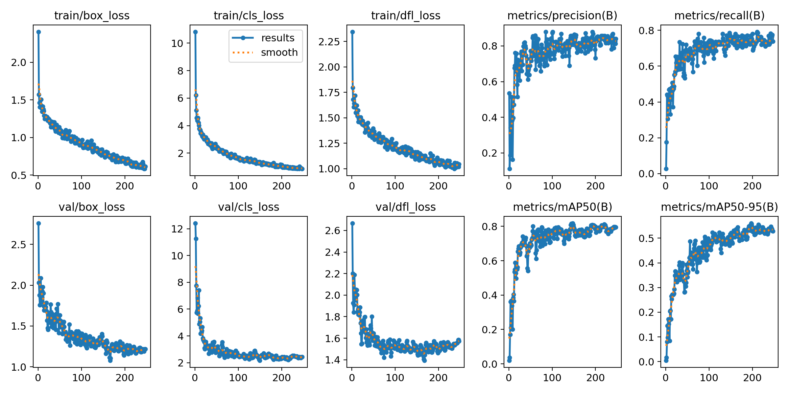

# 📄 A Layout-Aware Resume Parsing Pipeline Using YOLO, OCR, NLP

## 🔍 Project Overview

โครงการนี้มีเป้าหมายเพื่อพัฒนาระบบ **Resume Parsing แบบ Layout‑Aware** สำหรับแปลงเรซูเม่ในรูปแบบ **ภาพหรือไฟล์ PDF** ซึ่งเป็นเอกสารที่ไม่มีโครงสร้าง (unstructured documents) 
ให้กลายเป็น **ข้อมูลเชิงโครงสร้าง (Structured Data)** โดยอัตโนมัติ ระบบถูกออกแบบให้เข้าใจทั้ง **โครงสร้างการจัดวางของเอกสาร (Document Layout)** และ **ความหมายของข้อความ (Semantic Content)** 
ผ่านสถาปัตยกรรมแบบ **Multi‑Stage Hybrid Pipeline** ที่ผสานเทคนิคจาก **Computer Vision, OCR และ Natural Language Processing (NLP)** เข้าด้วยกัน

โครงการนี้ได้รับแรงบันดาลใจจากงานวิจัย  
**_A Hybrid OCR–XGBoost–Transformer Pipeline for Resume Parsing with Spatial‑Semantic Integration_**  
โดยมีการปรับสถาปัตยกรรมให้เหมาะสมกับการใช้ **Vision‑based Layout Detection** ด้วย YOLO

---

## ❗️ Problem Statement
เรซูเม่มักอยู่ในรูปแบบเอกสารที่ไม่มีโครงสร้าง เช่น PDF หรือรูปภาพ และมีรูปแบบการจัดวางที่แตกต่างกันไปอย่างมาก ทำให้การดึงข้อมูลสำคัญ เช่น Education, Experience และ Skills ไม่สามารถทำได้อย่างแม่นยำด้วยการประมวลผลข้อความเพียงอย่างเดียว ระบบ Resume Parsing แบบดั้งเดิมที่อาศัยกฎตายตัวหรือ template มักไม่สามารถรองรับเรซูเม่ที่มี layout หลากหลายได้อย่างมีประสิทธิภาพ โดยเฉพาะเรซูเม่ที่มีหลายคอลัมน์หรือรูปแบบเชิงสร้างสรรค์ ปัญหาหลักคือการขาดระบบที่สามารถ **เชื่อมโยงข้อมูลเชิงพื้นที่ของเอกสารเข้ากับการประมวลผลเชิงความหมายของข้อความ** เพื่อแปลงเรซูเม่ที่ไม่มีโครงสร้างให้เป็นข้อมูลเชิงโครงสร้างได้อย่างถูกต้อง

---

## 🎯 Objectives

- พัฒนาระบบ Resume Parsing แบบ **Layout‑Aware**
- ตรวจจับและแยก section หลักของเรซูเม่โดยอัตโนมัติ
- ดึงข้อความจากแต่ละ section อย่างแม่นยำ
- ประมวลผลข้อความเชิงความหมายแบบ **Section‑Aware**
- แปลงข้อมูลเรซูเม่ให้อยู่ในรูปแบบ **Structured JSON**

---

## 📚 Dataset Description
ชุดข้อมูลที่ใช้ในโครงการประกอบด้วย **เรซูเม่จำนวน 200 ใบ** ในรูปแบบไฟล์ภาพและ PDF  
ลักษณะของข้อมูล:
- 🗂 โครงสร้างเรซูเม่หลากหลาย (1–2 คอลัมน์)
- 🌐 ทั้งภาษาไทยและภาษาอังกฤษ
- 🧪 ใช้สำหรับการฝึกและทดสอบระบบ Layout Detection และ Parsing

---

## 🛠️ Tools & Libraries
- ⚡ **YOLO11** – ตรวจจับโครงสร้างและส่วนประกอบของเรซูเม่  
- 🎥 **OpenCV** – จัดการและประมวลผลภาพ  
- 🔤 **OCR Engine (Google Cloud Vision)** – แปลงข้อความจากภาพ  
- 🧾 **pythainlp** – ประมวลผลภาษาธรรมชาติและดึงข้อมูลเชิงความหมาย  
- 🐍 **Python** – ภาษาหลักในการพัฒนาระบบ
- 🖼️ **PyMuPDF** – แปลงไฟล์ PDF เป็นรูปภาพ JPG

---

## 🔗 System Architecture


---

## ⚙️ Methodology

ระบบถูกออกแบบในรูปแบบ **Layout-Aware Multi-Stage Pipeline** โดยมีการทดลองและเปรียบเทียบโมเดลในแต่ละขั้นตอนที่สำคัญ เพื่อคัดเลือกโมเดลที่เหมาะสมที่สุดสำหรับการประมวลผลเรซูเม่ที่มีรูปแบบหลากหลาย

### 1️⃣ Layout Detection (YOLO11 Series)
ในขั้นตอนการตรวจจับโครงสร้างเรซูเม่ ได้ทดลองใช้โมเดล **YOLO11n, YOLO11s, YOLO11m และ YOLO11xl** เพื่อเปรียบเทียบประสิทธิภาพในการตรวจจับ section หลักของเรซูเม่ ได้แก่ Personality, Education, Experience, Skills, Project และ Training
การทดลองเปรียบเทียบพิจารณาจากตัวชี้วัดมาตรฐาน เช่น Precision, Recall และ mAP@0.5 ภายใต้เงื่อนไขการฝึกเดียวกัน

### 2️⃣ Section‑based Image Cropping
หลังจากได้ bounding box ของแต่ละ section จากโมเดลที่คัดเลือก ระบบจะทำการตัดภาพเรซูเม่ตามขอบเขตของแต่ละ section เพื่อแยกการประมวลผลข้อมูลแต่ละส่วนออกจากกัน ขั้นตอนนี้ช่วยลดสัญญาณรบกวนและรักษาบริบทเชิงพื้นที่ของข้อมูล

### 3️⃣ Optical Character Recognition (OCR)
ในขั้นตอนการดึงข้อความจากภาพ ได้ทดลองใช้งาน OCR engine หลายตัว เช่น PaddleOCR, Surya OCR, EasyOCR, Google Cloud Vision เพื่อเปรียบเทียบความสามารถในการอ่านข้อความภาษาไทยและความเสถียรในการใช้งาน ภายใต้สภาพแวดล้อม Google Colab

### 4️⃣ Semantic Information Extraction (NLP)
ข้อความที่ได้จาก OCR จะถูกนำมาประมวลผลเชิงความหมายด้วยเทคนิค NLP สำหรับข้อความภาษาไทย โดยจะเปรียบเทียบจาก NLP engine หลายตัว เช่น PyThaiNLP, spaCy, WangchanBERTa เป็นต้น เพื่อช่วยในการตัดคำและจัดรูปแบบข้อความ การประมวลผลในขั้นตอนนี้ถูกออกแบบให้เป็นแบบ **Section-Aware Semantic Extraction** เพื่อเพิ่มความถูกต้องในการตีความข้อมูลภายใต้บริบทของ section

### 5️⃣ Structured Output
ผลลัพธ์สุดท้ายของระบบจะถูกจัดเก็บในรูปแบบ **Structured JSON** ซึ่งสะท้อนโครงสร้างของเรซูเม่และสามารถนำไปใช้งานหรือพัฒนาต่อยอดในระบบอื่นได้

---


## 🧩 Experimental / Sample Results

ส่วนนี้นำเสนอผลลัพธ์จากการทดลองของระบบตั้งแต่ขั้นตอนการเตรียมข้อมูล ไปจนถึงผลลัพธ์ของการตรวจจับโครงสร้างเรซูเม่ และการประมวลผลในแต่ละ stage เพื่อแสดงการทำงานจริงของ Layout‑Aware Resume Parsing Pipeline

### 👀 1. การจับคู่ข้อมูลรูปภาพและป้ายกำกับ (Image–Label Pairing)
คือการเตรียมและตรวจสอบความถูกต้องของข้อมูลที่ใช้ในการฝึกโมเดลตรวจจับโครงสร้างเอกสาร (Layout Detection) ซึ่งประกอบด้วยการจับคู่ระหว่างไฟล์รูปเรซูเม่และไฟล์ป้ายกำกับ (label) ที่ระบุขอบเขตและประเภทของแต่ละ section

### 📚 1.1 Input
ข้อมูลนำเข้า (Input) เป็นเรซูเม่ในรูปแบบไฟล์ภาพหรือ PDF ซึ่งทั้งหมดจะผ่านการแปลงเป็นภาพก่อนนำเข้าสู่กระบวนการประมวลผล โดยเรซูเม่แต่ละใบมีรูปแบบการจัดวางที่แตกต่างกัน เช่น แบบหนึ่งคอลัมน์และสองคอลัมน์

**Code:**
```python
pix = page.get_pixmap(dpi=200) 
```

**Input:** รูปเรซูเม่ต้นฉบับทั้ง 2 แบบ (1 column และ แบบ 2 column) โดยยังไม่มีการแบ่ง section หรือประมวลผลใด 


### 🔢 1.2 Label
ป้ายกำกับ (Label) ถูกสร้างขึ้นเพื่อระบุขอบเขตของแต่ละ section ภายในเรซูเม่ โดย Label มีทั้งหมด 6 Label ได้แก่ Personality, Education, Experience, Skill, Project, Training โดยใช้รูปแบบ bounding box เพื่อกำหนดตำแหน่งเชิงพื้นที่ของข้อมูลในหน้าเอกสาร 


### 🧮 1.3 Output (ผลลัพธ์จากขั้นตอนการ Labeling)

ผลลัพธ์ของขั้นตอนนี้คือชุดข้อมูลที่ผ่านการจับคู่ระหว่างรูปเรซูเม่และป้ายกำกับอย่างสมบูรณ์ (image–label pairs) ซึ่งจะนำไปใช้เป็นข้อมูลฝึกและทดสอบโมเดล Layout Detection ในขั้นตอนถัดไป 

**Output:**


---

### 🧿 2. การตรวจจับโครงสร้างเรซูเม่ด้วย YOLO11 (YOLO11 Series)

เพื่อคัดเลือกโมเดลที่เหมาะสมที่สุดสำหรับการตรวจจับโครงสร้างเรซูเม่ ได้มีการทดลองฝึกและประเมินโมเดล YOLO11 หลายขนาด ได้แก่ **YOLO11n, YOLO11s, YOLO11m และ YOLO11xl**

#### 🤖 2.1 กระบวนการ (Process)

ในขั้นตอนนี้ เรซูเม่ในรูปแบบภาพที่ผ่านการเตรียมและมีป้ายกำกับ (label) จากขั้นตอน Image–Label Pairing จะถูกนำมาใช้เป็นข้อมูลนำเข้า สำหรับการฝึกและทดสอบโมเดล YOLO11 แต่ละขนาด โดยแต่ละโมเดลถูกฝึกภายใต้เงื่อนไขเดียวกัน เพื่อให้สามารถเปรียบเทียบประสิทธิภาพได้อย่างเป็นธรรม
กระบวนการทำงานของโมเดล YOLO11 ประกอบด้วย:
- รับภาพเรซูเม่เป็น input
- ประมวลผลภาพผ่าน convolutional neural network
- ตรวจจับตำแหน่ง bounding box ของแต่ละ section
- จำแนกประเภทของ section ได้แก่ Personality, Education, Experience, Skills, Project และ Training

#### 🖼️ 2.2 การคัดเลือกโมเดล (Model Selection)

จากการทดลองเปรียบเทียบโมเดล YOLO11 หลายขนาด พบว่าโมเดลแต่ละขนาดมีจุดเด่นที่แตกต่างกัน โดยโมเดลขนาดเล็ก (YOLO11n) มีความรวดเร็วในการประมวลผลแต่ให้ความแม่นยำต่ำกว่า ในขณะที่โมเดลขนาดใหญ่ (YOLO11m และ YOLO11xl) ให้ความแม่นยำสูงขึ้นแต่มีความซับซ้อนและใช้ทรัพยากรในการประมวลผลมากกว่า

จาก Confusion Matrix แสดงให้เห็นว่า **YOLO11s** ให้สมดุลที่เหมาะสมที่สุดระหว่างความแม่นยำในการตรวจจับโครงสร้างเรซูเม่และประสิทธิภาพในการประมวลผล โดยสามารถตรวจจับ section หลักของเรซูเม่ได้อย่างมีประสิทธิภาพ อยู่ในระดับที่เพียงพอสำหรับการใช้งานเป็นโมดูล Layout Detection ในระบบ Resume Parsing

ดังนั้นจึงเลือกใช้ **YOLO11s** เป็นโมเดลหลักสำหรับขั้นตอนการตรวจจับโครงสร้างเอกสาร เนื่องจากสามารถแยก section ได้อย่างชัดเจน และเหมาะสมกับการนำผลลัพธ์ไปใช้ในขั้นตอน OCR และการประมวลผลเชิงความหมายในลำดับถัดไป


#### 📈 2.3 ผลลัพธ์ของ YOLO11s และการประเมินผลโมเดล (Results and Evaluation)

**Code:**
```python
model = YOLO('yolo11s.pt')
results = model.train(data='data.yaml', epochs=300, imgsz=1280, ...)
```

**Output:**


#### 🏗️ Training and Validation Analysis


กราฟแสดงค่า training loss และ validation loss ของโมเดล YOLO11s แสดงแนวโน้มลดลงอย่างต่อเนื่องในทิศทางเดียวกัน ซึ่งบ่งชี้ถึงการเรียนรู้ที่มีเสถียรภาพและไม่พบอาการ overfitting ค่า Precision, Recall และ mAP เพิ่มขึ้นตามจำนวน epoch และมีแนวโน้มคงที่ในช่วงท้าย  
แสดงให้เห็นว่าโมเดลสามารถเรียนรู้โครงสร้างเชิงพื้นที่ของเรซูเม่ได้อย่างมีประสิทธิภาพ และเหมาะสมสำหรับใช้งานเป็นโมดูล Layout Detection ใน pipeline

#### 📊 2.4 ผลการประเมินรายคลาส (Per-Class Results)
การประเมินประสิทธิภาพของโมเดล YOLO11s เพื่อวัดความสามารถของโมเดลในการระบุขอบเขตและประเภทของแต่ละ section ภายในเอกสาร จะใช้ตัวชี้วัดมาตรฐานสำหรับงานตรวจจับวัตถุ ได้แก่ 
- **Precision** วัดความแม่นยำของการตรวจจับ โดยแสดงสัดส่วนของ bounding box ที่โมเดลตรวจจับได้อย่างถูกต้องเทียบกับจำนวนที่โมเดลทำนายทั้งหมด (Precision สูงหมายถึงโมเดลไม่ตรวจจับผิดพลาดบ่อย)
- **Recall** วัดความสามารถของโมเดลในการตรวจจับ section ที่มีอยู่จริงในเรซูเม่ (Recall สูงหมายถึงโมเดลพลาดน้อย)
- **mAP@0.5 (Mean Average Precision at IoU 0.5)** เป็นคะแนนรวมที่สะท้อนทั้งความแม่นยำของตำแหน่ง bounding box และการจำแนกประเภท โดยพิจารณาว่า bounding box ที่ตรวจจับได้มีค่าความซ้อนทับ (IoU) กับข้อมูลจริงอย่างน้อย 50%

**Code:**
```python
model = YOLO('best.pt')
metrics = model.val()
```
**Output:**
| Class        | Precision | Recall | mAP50 |
|--------------|-----------|--------|-------|
| Personality  | 100.0%    | 62.9%  | 80.9% |
| Education    | 72.0%     | 56.5%  | 65.5% |
| Experience   | 94.7%     | 56.0%  | 72.3% |
| Skill        | 70.8%     | 40.5%  | 60.4% |
| Project      | 75.5%     | 100.0% | 97.3% |
| Training     | 97.6%     | 78.6%  | 81.7% |
| **Overall**  | –         | –      | **76.3%** |

ผลการประเมินแสดงให้เห็นว่าโมเดล YOLO11s สามารถตรวจจับโครงสร้างเรซูเม่ได้อย่างมีประสิทธิภาพ โดยมีค่า **mAP@0.5 เฉลี่ยเท่ากับ 76.3%** ซึ่งอยู่ในระดับที่เหมาะสมสำหรับงานตรวจจับ layout ของเอกสารที่มีรูปแบบการจัดวางหลากหลาย

คลาส **Project** ให้ผลลัพธ์ที่โดดเด่น โดยมีค่า Recall สูงถึง 100% และ mAP50 เท่ากับ 97.3% แสดงให้เห็นว่าโมเดลสามารถตรวจจับ section ที่มีลักษณะเป็น block ขนาดใหญ่และมีขอบเขตชัดเจนได้เป็นอย่างดี ในทางตรงกันข้าม คลาส **Skill** มีค่า Recall และ mAP50 ต่ำกว่าคลาสอื่น เนื่องจาก section ประเภทนี้มักมีขนาดเล็ก จัดวางได้ในหลายตำแหน่ง หรือมีรูปแบบไม่สม่ำเสมอ ซึ่งเพิ่มความยากในการตรวจจับเชิงภาพ

โดยภาพรวม ผลลัพธ์ในขั้นตอนนี้ยืนยันว่า YOLO11s สามารถทำหน้าที่เป็นโมดูลสำหรับ **Layout Detection** ได้อย่างเหมาะสม และให้ bounding box ที่มีความแม่นยำเพียงพอสำหรับการนำไปใช้เป็นข้อมูลนำเข้าให้กับขั้นตอนการดึงข้อความ (OCR) และการประมวลผลเชิงความหมายในลำดับถัดไป

---

### 🧾🔤 3. การดึงข้อความจากแต่ละ Section (Optical Character Recognition (OCR))

ในขั้นตอนการดึงข้อความจากภาพ ระบบจำเป็นต้องเลือก OCR engine ที่สามารถรองรับเรซูเม่ภาษาไทยและภาษาอังกฤษ และสามารถทำงานได้อย่างเสถียรภายใต้สภาพแวดล้อม Google Colab ดังนั้นจึงได้ทำการทดลองและเปรียบเทียบ OCR หลายตัวก่อนตัดสินใจเลือก OCR engine หลักของระบบ
ได้แก่ PaddleOCR (หลายเวอร์ชัน), EasyOCR, Surya OCR, Tesseract และ Google Cloud Vision โดยพิจารณาจากปัจจัยหลักดังต่อไปนี้

ผลการทดลองพบว่า OCR engine ส่วนใหญ่ประสบปัญหาในด้าน dependency หรือความไม่เข้ากันกับเวอร์ชันของ Python และ NumPy ที่ใช้งานบน Google Colab ในช่วงเวลาทดลอง โดยเฉพาะ PaddleOCR และ Surya OCR ซึ่งไม่สามารถรันได้อย่างเสถียร ในขณะที่ EasyOCR แม้จะใช้งานได้ แต่คุณภาพการอ่านภาษาไทยยังไม่สม่ำเสมอ ในทางตรงกันข้าม **Google Cloud Vision** สามารถอ่านภาษาไทยได้ดี มีความเสถียรสูง และไม่พบปัญหา dependency ภายใต้สภาพแวดล้อมที่ใช้งาน แต่ต้องมี API Key โดยใช้งานได้ฟรี 1,000 รูป/เดือน

#### ☁️ 3.1 Google Cloud Vision Pipeline

หลังจากได้ผลลัพธ์การตรวจจับโครงสร้างเรซูเม่จากโมเดล YOLO11s ในขั้นตอนที่ 2 แล้ว ระบบจะนำ bounding box ของแต่ละ section มาใช้เป็นข้อมูลนำเข้าสำหรับกระบวนการดึงข้อความจากภาพด้วย **Google Cloud Vision API** 
กระบวนการทำงานประกอบไปด้วย Function ต่าง ๆ ดังนี้

**Function 1: preprocess_crop() เตรียมรูปก่อนส่งให้ OCR อ่าน**
```python
def preprocess_crop(crop_img):
    h, w = crop_img.shape[:2]
    if h < 50:
        scale = 50 / h
        crop_img = cv2.resize(...)
    return crop_img
```

**Function 2: postprocess_thai() ทำความสะอาดข้อความไทยที่ OCR อ่านได้**
```python
def postprocess_thai(text):
    text = th_normalize(text)
    text = ' '.join(text.split())
    return text
```

**Function 3: extract_text_from_crop() ส่งรูปไป Google Cloud Vision API แล้วรับข้อความกลับมา**
```python
def extract_text_from_crop(crop_img):
    # 1.
    _, buffer = cv2.imencode('.jpg', processed)
    img_base64 = base64.b64encode(buffer).decode('utf-8')
    # 2.
    payload = {
        'requests': [{
            'image': {'content': img_base64},
            'features': [{'type': 'TEXT_DETECTION'}],
            'imageContext': {'languageHints': ['th', 'en']}
        }]
    }
    # 3.
    response = requests.post(VISION_URL, json=payload)
    # 4. 
    raw_text = result['responses'][0]['textAnnotations'][0]['description']
    clean_text = postprocess_thai(raw_text)
    return raw_text, clean_text
```

**Function 4: parse_resume() Pipeline YOLO detect -> crop -> OCR -> JSON**
```python
def parse_resume(image_path):
    # 1.
    results = yolo_model.predict(image_path, conf=0.25)
    # 2. 
    boxes = sorted(r.boxes, key=lambda x: x.xyxy[0][1])
    # 3. 
    for box in boxes:
        x1, y1, x2, y2 = map(int, box.xyxy[0])  # 
        label = yolo_model.names[int(box.cls[0])]  #  class
        conf = float(box.conf[0])  # 
        # 4.
        crop = img_bgr[cy1:cy2, cx1:cx2]
        # 5.
        raw_text, clean_text = extract_text_from_crop(crop)
        # 6. 
        sections.append({type, confidence, bbox, raw_text, clean_text})
    # 7.
    gc.collect()
    return {source_file, sections, metadata}
```
#### 📦 3.2 ผลลัพธ์ (Results)

ผลลัพธ์จาก Google Cloud Vision แสดงให้เห็นว่าระบบสามารถดึงข้อความจากแต่ละ section ของเรซูเม่ได้อย่างมีประสิทธิภาพ โดยข้อความที่ได้ถูกจัดกลุ่มตามประเภทของ section อย่างชัดเจน 

**Output:**


```json
{
  "source_file": "Jennifer Mabangkru_page_0001.jpg",
  "sections": [
    {
      "type": "Personality",
      "confidence": 0.381,
      "bbox": [
        473,
        185,
        1228,
        579
      ],
      "raw_text": "Jennifer Mabangkru\nCEO & Senior Business Consultant\nMy expertise and passion lie in business strategy\nplanning and solutions to achieve clients' goals by\nproviding analysis and vision with my expertise in market\npenetration, manufacturing line planning, organizational management, servicing, accounting, and legal issues.",
      "clean_text": "Jennifer Mabangkru CEO & Senior Business Consultant My expertise and passion lie in business strategy planning and solutions to achieve clients' goals by providing analysis and vision with my expertise in market penetration, manufacturing line planning, organizational management, servicing, accounting, and legal issues."
    },
    {
      "type": "Experience",
      "confidence": 0.3522,
      "bbox": [
        570,
        585,
        1231,
        1056
      ],
      "raw_text": "Work Experience\nDiplomatic Representative (Internship) 2018\nPermanent Mission of Thailand to the United Nations, New York City, USA\nPeacekeeping field, Economic-Social Council, Human rights council\nPurchasing Manager and Head of Brand Management Section and manage team",
      "clean_text": "Work Experience Diplomatic Representative (Internship) 2018 Permanent Mission of Thailand to the United Nations, New York City, USA Peacekeeping field, Economic-Social Council, Human rights council Purchasing Manager and Head of Brand Management Section and manage team"
    },
    {
      "type": "Education",
      "confidence": 0.8955,
      "bbox": [
        0,
        876,
        582,
        1092
      ],
      "raw_text": "Education\nMaster of Business Administration\n(Finance and Banking Management)\nRamkhamhaeng University\nLawyer License Class LX\nLawyers Council Under the Royal Patronage\nBachelor of Law (Administrative and Public Law)\nChulalongkorn University",
      "clean_text": "Education Master of Business Administration (Finance and Banking Management) Ramkhamhaeng University Lawyer License Class LX Lawyers Council Under the Royal Patronage Bachelor of Law (Administrative and Public Law) Chulalongkorn University"
    },
    {
      "type": "Skill",
      "confidence": 0.7327,
      "bbox": [
        578,
        1069,
        1211,
        1322
      ],
      "raw_text": ")s)\nSkills\nTRANSLATOR & INTERPRETER\nFACTORY LINE PLANNING\nCOMPANY SECRETARY\nINTERNATIONAL TAX PLANNING\nSAP S/4 HANA\nINFOGRAPHIC\nSOCIAL MEDIA\nE-COMMERCE",
      "clean_text": ")s Skills TRANSLATOR & INTERPRETER FACTORY LINE PLANNING COMPANY SECRETARY INTERNATIONAL TAX PLANNING SAP S/4 HANA INFOGRAPHIC SOCIAL MEDIA E-COMMERCE"
    },
    {
      "type": "Experience",
      "confidence": 0.524,
      "bbox": [
        588,
        1319,
        1187,
        1691
      ],
      "raw_text": "Awards\nBangkok Youth Role Model 2006\nBangkok Governor, Apirak Kosayodhin\nThe Youth Role Model 2006\nOffice of the Narcotics Control Board (ONCB)\nExcellent Military Leadership 2009\nReserve Affairs Center of Thailand",
      "clean_text": "Awards Bangkok Youth Role Model 2006 Bangkok Governor, Apirak Kosayodhin The Youth Role Model 2006 Office of the Narcotics Control Board (ONCB) Excellent Military Leadership 2009 Reserve Affairs Center of Thailand"
    }
  ]
}

```
---

## 😄🙏to be continued 

### 4. การดึงข้อมูลเชิงความหมาย (Semantic Information Extraction)

---

### 5. Job Matching กับ ฐานข้อมูลการรับสมัครงานจาก Linkedin

---

