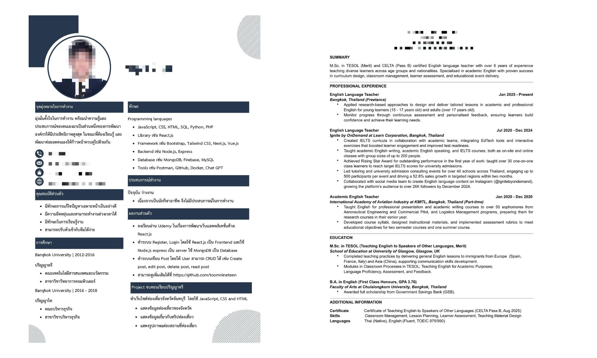
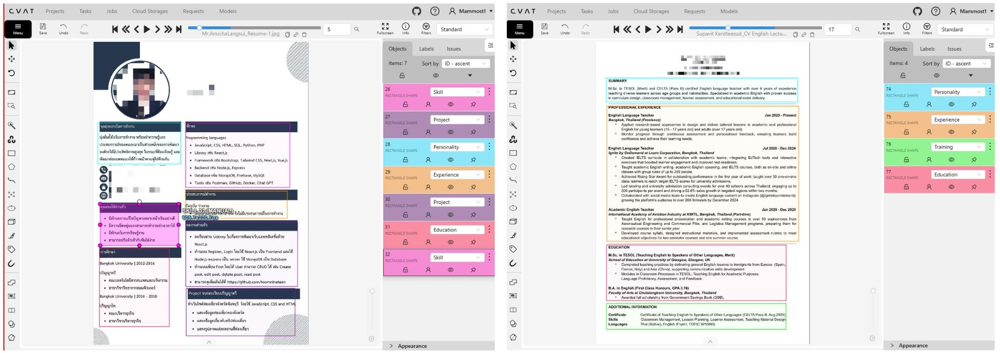
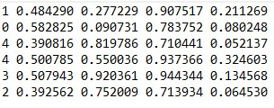
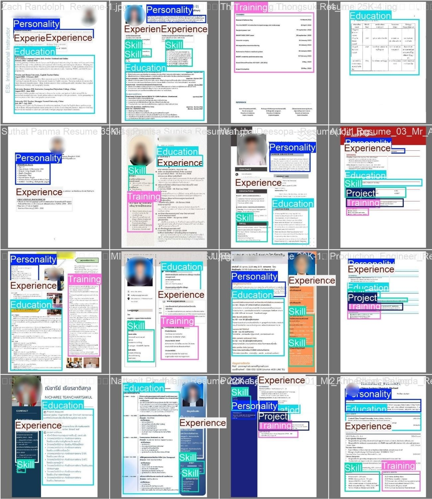
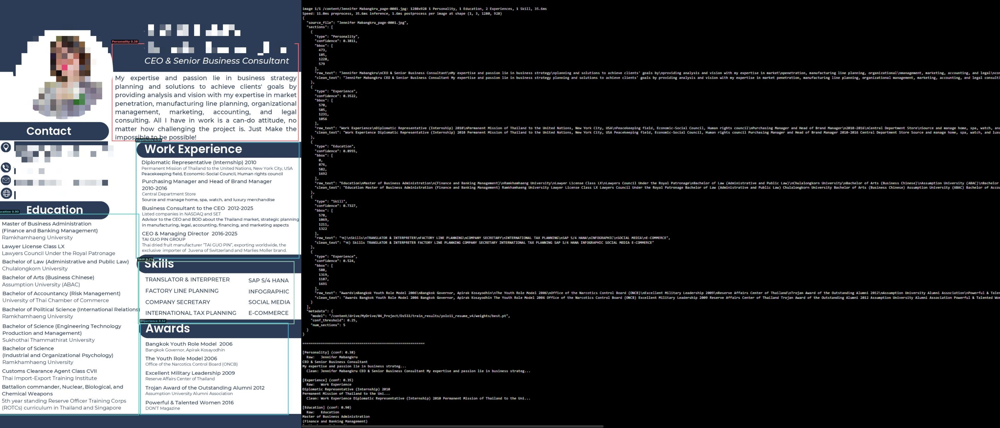

# A Layout-Aware Resume Parsing Pipeline Using YOLO, OCR, and NLP

## Project Overview

โครงการนี้มีเป้าหมายเพื่อพัฒนาระบบ **Resume Parsing แบบ Layout-Aware** สำหรับแปลงเรซูเม่ในรูปแบบภาพหรือ PDF ซึ่งเป็นเอกสารที่ไม่มีโครงสร้าง ให้กลายเป็นข้อมูลเชิงโครงสร้างโดยอัตโนมัติ ระบบถูกออกแบบให้เข้าใจทั้งการจัดวางของเอกสาร (layout) และความหมายของข้อความ (semantic content) ร่วมกัน เพื่อรองรับเรซูเม่ที่มีรูปแบบหลากหลาย

ระบบใช้สถาปัตยกรรมแบบ **Hybrid Pipeline** โดยผสานเทคนิคจาก Computer Vision, Optical Character Recognition (OCR) และ Natural Language Processing (NLP) เริ่มจากการตรวจจับโครงสร้างของเรซูเม่ด้วย YOLO จากนั้นดึงข้อความด้วย OCR และประมวลผลเชิงความหมายเพื่อสร้างผลลัพธ์ในรูปแบบข้อมูลเชิงโครงสร้าง (Structured JSON)

โครงการนี้ได้รับแรงบันดาลใจจากงานวิจัยเรื่อง  
**“A Hybrid OCR–XGBoost–Transformer Pipeline for Resume Parsing with Spatial‑Semantic Integration”**

---

## Problem Statement

เรซูเม่มักอยู่ในรูปแบบเอกสารที่ไม่มีโครงสร้าง เช่น PDF หรือรูปภาพ และมีการจัดวางข้อมูลที่แตกต่างกันไป ข้อมูลที่มีความหมาย เช่น Education, Experience และ Skills จึงไม่สามารถดึงออกมาใช้งานโดยอัตโนมัติได้ง่าย ระบบที่พึ่งพาการประมวลผลข้อความเพียงอย่างเดียวหรือกฎแบบตายตัวมักไม่สามารถรองรับความหลากหลายของรูปแบบเรซูเม่ได้อย่างมีประสิทธิภาพ

ปัญหาหลักคือการขาดระบบที่สามารถใช้ทั้งตำแหน่งของข้อความในเอกสารและความหมายของเนื้อหาร่วมกัน เพื่อแยกส่วนข้อมูลสำคัญและแปลงเรซูเม่ที่ไม่มีโครงสร้างให้เป็นข้อมูลเชิงโครงสร้างได้อย่างถูกต้อง

---

## Objectives

- พัฒนาระบบ Resume Parsing แบบ **Layout-Aware**
- ผสานเทคนิคจาก **Computer Vision, OCR และ NLP** ในรูปแบบ Hybrid Pipeline
- แยกส่วนประกอบหลักของเรซูเม่ เช่น Education, Experience และ Skills โดยอัตโนมัติ
- ดึงข้อมูลเชิงความหมายจากแต่ละส่วนของเรซูเม่ได้อย่างเป็นระบบ
- แปลงเรซูเม่ที่ไม่มีโครงสร้างให้เป็นข้อมูลเชิงโครงสร้าง (Structured JSON)

---

## Dataset Description

ชุดข้อมูลที่ใช้ประกอบด้วย **เรซูเม่จำนวน 200 ใบ** ในรูปแบบไฟล์ภาพและ PDF โดยมีความหลากหลายของโครงสร้างการจัดวาง และใช้ทั้งภาษาไทยและภาษาอังกฤษ ข้อมูลชุดนี้ถูกใช้เพื่อทดสอบความสามารถของระบบในการตรวจจับโครงสร้างเอกสารและดึงข้อมูลจากเรซูเม่ที่ไม่มีโครงสร้าง

---

## Tools & Libraries
- **YOLO11s** – ตรวจจับโครงสร้างและส่วนประกอบของเรซูเม่  
- **OpenCV** – จัดการและประมวลผลภาพ  
- **OCR Engine (Google Cloud Vision)** – แปลงข้อความจากภาพ  
- **pythainlp** – ประมวลผลภาษาธรรมชาติและดึงข้อมูลเชิงความหมาย  
- **Python** – ภาษาหลักในการพัฒนาระบบ  

---

## Methodology

---

## System Architecture

Resume Image / PDF
↓
Layout Detection (YOLO)
↓
Section-based Cropping
↓
Optical Character Recognition (OCR)
↓
Semantic Information Extraction (NLP / NER)
↓
Structured Resume Output (JSON)

---

## Experimental / Sample Results
หัวข้อนี้นำเสนอผลลัพธ์ตัวอย่างจากการทำงานของระบบในแต่ละขั้นตอน เพื่อแสดงให้เห็นการทำงานจริงของ pipeline ตั้งแต่การเตรียมข้อมูล การตรวจจับโครงสร้างเอกสาร จนถึงผลลัพธ์ที่ได้จากระบบ

### 1. การจับคู่ข้อมูลรูปภาพและป้ายกำกับ (Image–Label Pairing)
ขั้นตอนแรกของการทดลองคือการเตรียมและตรวจสอบความถูกต้องของข้อมูลที่ใช้ในการฝึกโมเดลตรวจจับโครงสร้างเอกสาร (Layout Detection) ซึ่งประกอบด้วยการจับคู่ระหว่างไฟล์รูปเรซูเม่และไฟล์ป้ายกำกับ (label) ที่ระบุขอบเขตและประเภทของแต่ละ section

### 1.1 Input
ข้อมูลนำเข้า (Input) เป็นเรซูเม่ในรูปแบบไฟล์ภาพหรือ PDF ซึ่งถูกแปลงเป็นภาพก่อนนำเข้าสู่กระบวนการประมวลผล โดยเรซูเม่แต่ละใบมีรูปแบบการจัดวางที่แตกต่างกัน เช่น แบบหนึ่งคอลัมน์และสองคอลัมน์
- ตัวอย่าง Input: รูปเรซูเม่ต้นฉบับทั้ง 2 แบบ (1 column และ แบบ 2 column) โดยยังไม่มีการแบ่ง section หรือประมวลผลใด ๆ

### 1.2 Label
ป้ายกำกับ (Label) ถูกสร้างขึ้นเพื่อระบุขอบเขตของแต่ละ section ภายในเรซูเม่ โดย Label มีทั้งหมด 6 Label ได้แก่ Personality, Education, Experience, Skill, Project, Training โดยใช้รูปแบบ bounding box เพื่อกำหนดตำแหน่งเชิงพื้นที่ของข้อมูลในหน้าเอกสาร ขั้นตอนนี้เป็นส่วนสำคัญสำหรับการฝึกโมเดล YOLO ให้เรียนรู้โครงสร้างของเรซูเม่

### 1.3 Output (ผลลัพธ์จากขั้นตอนการ Labeling)

ผลลัพธ์ของขั้นตอนนี้คือชุดข้อมูลที่ผ่านการจับคู่ระหว่างรูปเรซูเม่และป้ายกำกับอย่างสมบูรณ์ (image–label pairs) ซึ่งถูกใช้เป็นข้อมูลฝึกและทดสอบโมเดล Layout Detection ในขั้นตอนถัดไป การตรวจสอบความถูกต้องของการ label ในขั้นนี้ช่วยให้มั่นใจว่าโมเดลได้รับข้อมูลที่ถูกต้องและสอดคล้องกับโครงสร้างจริงของเอกสาร

---

### 2. YOLO11s: การตรวจจับโครงสร้างเรซูเม่ (Layout Detection Results)
หลังจากได้ชุดข้อมูลที่ผ่านการจับคู่ระหว่างรูปเรซูเม่และป้ายกำกับแล้วในขั้นตอนที่ 1 ชุดข้อมูลดังกล่าวถูกนำมาใช้เป็นข้อมูลนำเข้า (input) สำหรับการฝึกและทดสอบโมเดล **YOLO11s** เพื่อทำหน้าที่ตรวจจับโครงสร้างและส่วนประกอบหลักของเรซูเม่

### 2.1 กระบวนการ (Process)
ในขั้นตอนนี้ ระบบใช้โมเดล **YOLO11s** ซึ่งเป็นโมเดลตรวจจับวัตถุแบบ single-stage เพื่อระบุขอบเขต (bounding box) และประเภทของ section ภายในเรซูเม่จากภาพต้นฉบับ โดยข้อมูลนำเข้าของโมเดลคือรูปเรซูเม่ที่ผ่านการเตรียมและมีไฟล์ label กำกับจากขั้นตอนการ labeling

กระบวนการทำงานของ YOLO11s ประกอบด้วย:
- รับภาพเรซูเม่เป็น input
- ประมวลผลภาพผ่านโครงข่าย convolutional neural network
- ทำนายตำแหน่ง bounding box ของแต่ละ section
- ทำนายประเภทของ section สำหรับแต่ละ bounding box เช่น Education, Experience และ Skills

ผลลัพธ์ที่ได้จากโมเดลจะถูกนำไปใช้ในการตัดภาพ (cropping) แยกตาม section เพื่อส่งต่อให้กับขั้นตอน OCR ในลำดับถัดไป

### 2.2 ผลลัพธ์ (Results)

ผลลัพธ์จากการประมวลผลด้วย YOLO11s แสดงให้เห็นว่าโมเดลสามารถตรวจจับและแยกส่วนประกอบหลักของเรซูเม่ได้อย่างชัดเจน โดย bounding box ที่ได้สอดคล้องกับตำแหน่งจริงของข้อมูลในเอกสาร ตัวอย่างผลลัพธ์ประกอบด้วย:
- การตรวจจับส่วน Education ที่อยู่ด้านบนหรือด้านข้างของหน้าเอกสาร
- การแยกส่วน Experience ซึ่งมักมีข้อความหลายบรรทัด
- การระบุส่วน Skills ที่อาจอยู่ในรูปแบบรายการหรือกล่องข้อมูล

ผลลัพธ์ในขั้นตอนนี้ช่วยยืนยันว่าโมเดล YOLO11s สามารถเข้าใจโครงสร้างเชิงพื้นที่ของเรซูเม่ได้ และเป็นองค์ประกอบสำคัญที่ช่วยให้ขั้นตอนการดึงข้อความและการประมวลผลเชิงความหมายในลำดับถัดไปมีความแม่นยำมากขึ้น

## 2.3 การประเมินผลโมเดล (Evaluation)

การประเมินผลในขั้นตอนนี้มีวัตถุประสงค์เพื่อวัดประสิทธิภาพของโมเดล **YOLO11s** ในการตรวจจับโครงสร้างและส่วนประกอบของเรซูเม่ โดยใช้ชุดข้อมูลสำหรับการทดสอบ (validation set) ค่า metrics ที่ใช้ในการประเมินประกอบด้วย **Precision, Recall และ mAP@0.5 (mAP50)** ซึ่งเป็นตัวชี้วัดมาตรฐานสำหรับงานตรวจจับวัตถุ (object detection)

### เกณฑ์การประเมิน (Evaluation Metrics)

- **Precision** บ่งชี้ความแม่นยำของการทำนาย กล่าวคือ เมื่อโมเดลตรวจจับว่าเป็น section ใด section หนึ่ง ผลลัพธ์นั้นถูกต้องจริงมากน้อยเพียงใด (Precision สูง หมายถึง โมเดลไม่ทำนายผิดพลาดบ่อย)

- **Recall** บ่งชี้ความสามารถของโมเดลในการตรวจจับ section ที่มีอยู่จริงในเอกสาร (Recall สูง หมายถึง โมเดลไม่พลาดการตรวจจับ section)

- **mAP@0.5 (Mean Average Precision at IoU 0.5)** เป็นคะแนนรวมที่สะท้อนทั้งความแม่นยำของตำแหน่ง bounding box และการจำแนกคลาส โดยพิจารณาว่า bounding box ที่ตรวจจับได้มีความซ้อนทับกับความจริงอย่างน้อย 50% หรือไม่

### ผลการประเมินรายคลาส (Per-Class Results)

| Class        | Precision | Recall | mAP50 |
|--------------|-----------|--------|-------|
| Personality  | 100.0%    | 62.9%  | 80.9% |
| Education    | 72.0%     | 56.5%  | 65.5% |
| Experience   | 94.7%     | 56.0%  | 72.3% |
| Skill        | 70.8%     | 40.5%  | 60.4% |
| Project      | 75.5%     | 100.0% | 97.3% |
| Training     | 97.6%     | 78.6%  | 81.7% |
| **Overall**  | –         | –      | **76.3%** |

### การวิเคราะห์ผลลัพธ์ (Result Analysis)

ผลการประเมินแสดงให้เห็นว่าโมเดล YOLO11s สามารถตรวจจับโครงสร้างของเรซูเม่ได้ในระดับที่น่าพอใจ โดยมีค่า **mAP50 เฉลี่ยเท่ากับ 76.3%** ซึ่งถือว่าเหมาะสมสำหรับงานตรวจจับ layout ของเอกสารที่มีรูปแบบหลากหลาย

คลาสที่มีผลลัพธ์โดดเด่นคือ **Project** ซึ่งมีค่า Recall 100% และ mAP50 สูงถึง 97.3% แสดงว่าโมเดลสามารถตรวจจับ section ที่มีลักษณะเป็น block ขนาดใหญ่ได้อย่างแม่นยำ ในขณะที่คลาส **Skill** มีค่า Recall และ mAP50 ต่ำกว่าคลาสอื่น เนื่องจาก section นี้มักมีขนาดเล็ก ลักษณะเป็นรายการสั้น ๆ และมีรูปแบบการจัดวางที่แตกต่างกันไป ซึ่งทำให้การตรวจจับด้วยโมเดลเชิงภาพมีความท้าทายมากขึ้น

โดยรวม ผลลัพธ์ในขั้นตอนนี้ยืนยันว่าโมเดลสามารถทำหน้าที่เป็น module สำหรับ **Layout Detection** ได้อย่างเหมาะสม และเพียงพอที่จะนำผลลัพธ์ไปใช้เป็น input สำหรับกระบวนการดึงข้อความ (OCR) และการประมวลผลเชิงความหมายในขั้นตอนถัดไป

---

### 3. Google Cloud Vision: การดึงข้อความจากแต่ละ Section (OCR Results)

หลังจากได้ผลลัพธ์การตรวจจับโครงสร้างเรซูเม่จากโมเดล YOLO11s ในขั้นตอนที่ 2 แล้ว ระบบจะนำ bounding box ของแต่ละ section มาใช้เป็นข้อมูลนำเข้า (input) สำหรับกระบวนการดึงข้อความจากภาพด้วยบริการ **Google Cloud Vision API** ซึ่งทำหน้าที่เป็น Optical Character Recognition (OCR) engine หลักของระบบ

#### 3.1 กระบวนการ (Process)

ในขั้นตอนนี้ ระบบจะทำการตัดภาพ (cropping) ตามขอบเขต bounding box ของแต่ละ section ที่ได้จาก YOLO11s จากนั้นภาพที่ถูกแยกตาม section จะถูกส่งไปยัง Google Cloud Vision API เพื่อทำการแปลงข้อความจากภาพเป็นตัวอักษร

กระบวนการทำงานประกอบด้วย:
- รับ bounding box ของแต่ละ section จากผลการตรวจจับของ YOLO11s
- ตัดภาพเรซูเม่ตาม bounding box เพื่อแยกแต่ละ section ออกมา
- ส่งภาพของแต่ละ section ไปยัง Google Cloud Vision API
- รับผลลัพธ์ข้อความที่ถูกแปลงจากภาพ (OCR text)

การทำ OCR แยกตาม section ช่วยลดปัญหาการอ่านข้อความข้ามส่วน (cross‑section noise) และรักษาบริบทของข้อความให้สอดคล้องกับโครงสร้างเอกสาร

---

#### 3.2 ผลลัพธ์ (Results)

ผลลัพธ์จาก Google Cloud Vision แสดงให้เห็นว่าระบบสามารถดึงข้อความจากแต่ละ section ของเรซูเม่ได้อย่างมีประสิทธิภาพ โดยข้อความที่ได้ถูกจัดกลุ่มตามประเภทของ section อย่างชัดเจน ตัวอย่างผลลัพธ์ประกอบด้วย:
- ข้อความจากส่วน Education เช่น ชื่อปริญญาและสถาบันการศึกษา
- ข้อความจากส่วน Experience ซึ่งอาจมีรายละเอียดหลายบรรทัด
- ข้อความจากส่วน Skills ในรูปแบบรายการหรือข้อความสั้น

การใช้ Google Cloud Vision ช่วยให้ระบบรองรับเรซูเม่ที่มีทั้งภาษาไทยและภาษาอังกฤษได้ดี และให้คุณภาพผลลัพธ์ที่พร้อมสำหรับการประมวลผลเชิงความหมายในขั้นตอนถัดไป

---

### 4. การดึงข้อมูลเชิงความหมาย (Semantic Information Extraction)

หลังจากได้ข้อความจากแต่ละ section ด้วย Google Cloud Vision ในขั้นตอนที่ 3 แล้ว ระบบจะทำการประมวลผลข้อความด้วยเทคนิค Natural Language Processing (NLP) เพื่อดึงข้อมูลเชิงความหมายออกจากข้อความ โดยให้ความสำคัญกับบริบทของ section ที่ข้อความปรากฏ

สำหรับข้อความภาษาไทย ระบบใช้ไลบรารี **PyThaiNLP** เพื่อช่วยในการตัดคำ การปรับรูปแบบข้อความ และการเตรียมข้อมูลสำหรับการดึงข้อมูลเชิงความหมาย ในขณะที่ข้อความภาษาอังกฤษสามารถประมวลผลด้วยเครื่องมือ NLP ทั่วไปได้ ขั้นตอนนี้ออกแบบให้เป็น Section‑Aware Semantic Extraction กล่าวคือ ข้อความจากแต่ละ section จะถูกประมวลผลแยกจากกันภายใต้บริบทของ section นั้น ๆ

การใช้ PyThaiNLP ช่วยให้ระบบสามารถจัดการกับลักษณะเฉพาะของภาษาไทย เช่น การไม่มีตัวแบ่งคำ และความกำกวมของขอบเขตคำ ซึ่งช่วยเพิ่มความถูกต้องในการดึงข้อมูลจากเรซูเม่ภาษาไทย และทำให้ผลลัพธ์ที่ได้อยู่ในรูปแบบที่พร้อมสำหรับการจัดเก็บเป็นข้อมูลเชิงโครงสร้าง

---

